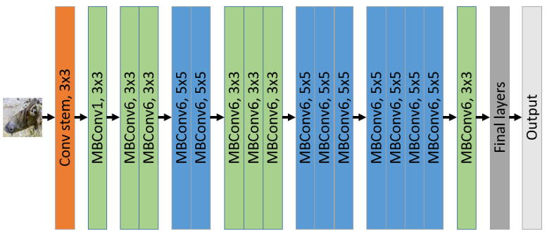
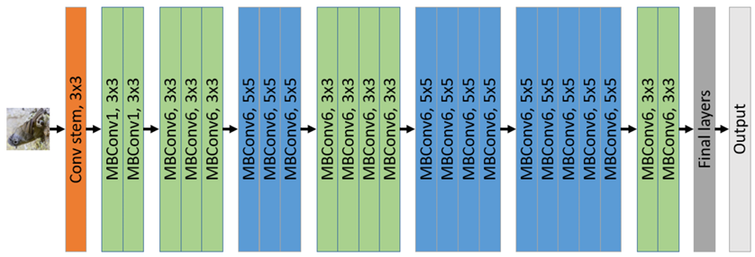
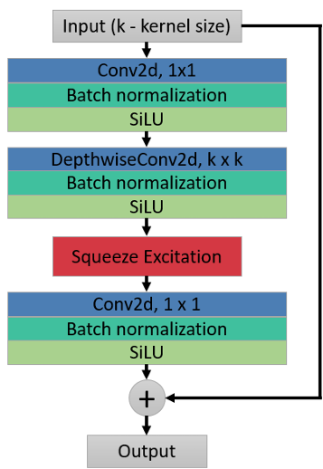
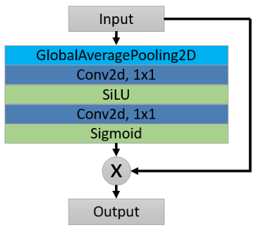
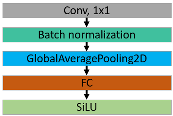

   <h1> (Bachelor Graduation Work)</h1>
   <h3>EfficientNet B0 and B1 built from scratch applied on the Bird multi-class classification</h3>
   

It is a research based project in which the main purpose was to apply EfficientNet from scratch with varying hyperparameters and compare the results with the pre-trained and fine-tuned models.

## Technology
- **Python**: Main programming language. 
- **PyTorch**: Machine Learning framework. 
- **Scikit-learn**: An open-source library in Python that helps us implement machine learning models. 

## Main Dataset: <a href="https://paperswithcode.com/dataset/cub-200-2011"> CUB-200-2011 (Caltech-UCSD Birds-200-2011) </a> 
- 11 788 bird images
- 200 labels
- Each consists of 50-60 images
- Bird images with different shapes (500x500, 200x200), positions (flying, swimming) and quality

## The second dataset:
- 3324 bird images
- 20 labels
- All images have the static shape of 224x224
- Regular quality

## Architecture (B0 and B1 in sequence)

## Architecture Blocks (MBConv, SE and Final blocks in sequence)

   
   
   

## Models
- EfficientNet-B0 and B1 models have been built from scratch and applied on the dataset
- Pre-trained B0 and B1 models have been fine-tuned on the dataset
- Results of the fine-tuned models and ones constructed from scratch have been analyzed and compared

## Results
- You can look at "Graduation_Work_Results.xlsx"

## Used methodologies and analysis of results 
- To deeply understand what has been done, you can read the "Bahruz_Huseynov_Graduation_Work.pdf" file
- For the brief information "Project_Brief_Information.pdf" can be read
